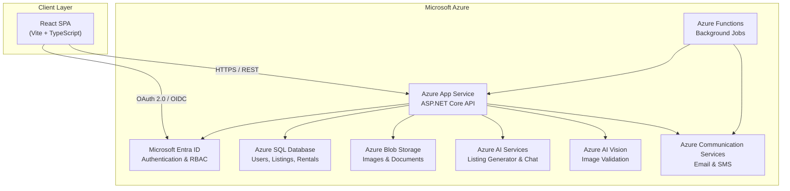
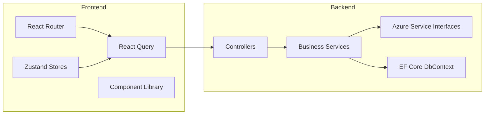
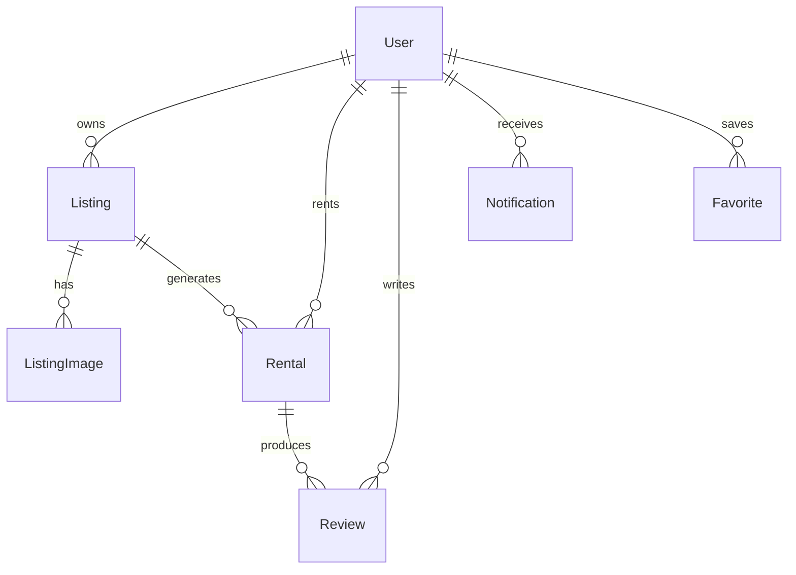
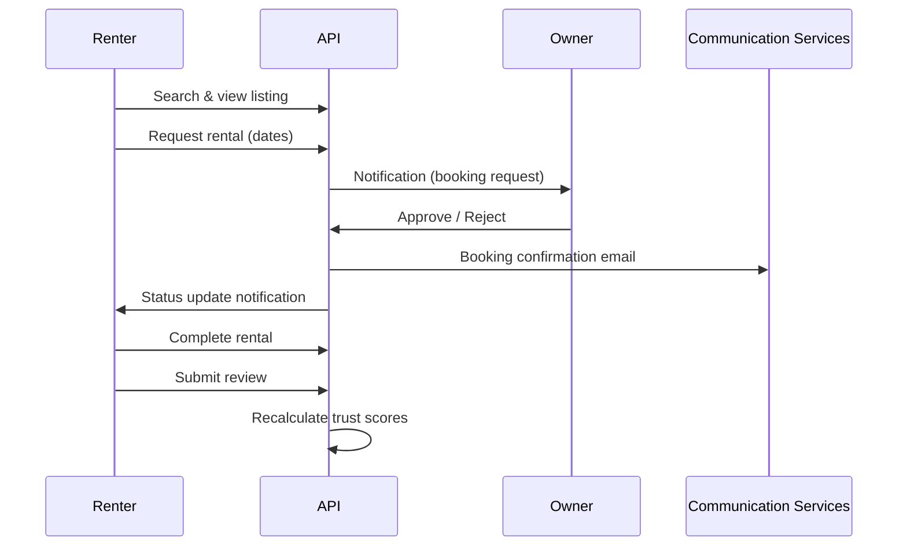
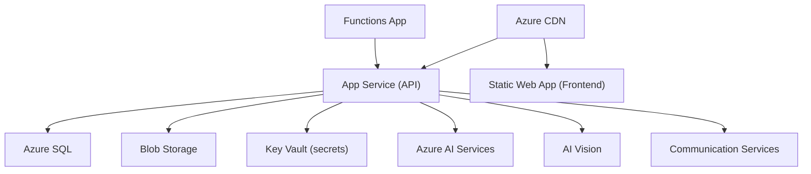

# RentThings Architecture

RentThings is an AI-powered peer-to-peer rental marketplace built on Microsoft Azure.

## System Overview

## Component Architecture

## Data Model

## Trust Score System

| Level | Score Range | Benefits |
|-------|-------------|----------|
| Bronze | 0–39 | Basic access |
| Silver | 40–59 | Standard visibility |
| Gold | 60–79 | Featured eligibility |
| Platinum | 80–100 | Priority support, lower deposits |

**Factors:** completed rentals (+3 each, max +30), review average, late returns (−5 each), account verification (+10).

## Rental Workflow

## Azure Integration Status

| Service | Interface | Local Dev |
|---------|-----------|-----------|
| Azure SQL | `RentThingsDbContext` | LocalDB / EnsureCreated |
| Blob Storage | `IBlobStorageService` | Mock (returns placeholder URLs) |
| Entra ID | `IEntraIdService` | Mock JWT auth |
| AI Services | `IAiServicesClient` | Mock responses |
| AI Vision | `IAiVisionService` | Mock validation |
| Communication Services | `ICommunicationService` | Logs only |
| Azure Functions | Timer triggers | Placeholder jobs |

## Deployment Topology

## Security

- JWT bearer authentication (Entra ID in production)
- Role-based access: Renter, Owner, Admin
- CORS restricted to frontend origins
- Image validation before listing approval
- Trust score gating for high-value rentals
